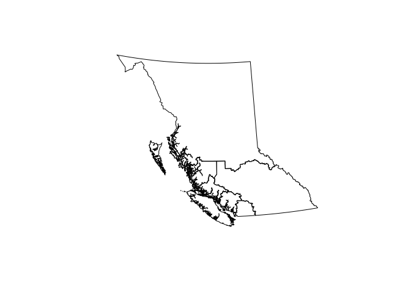
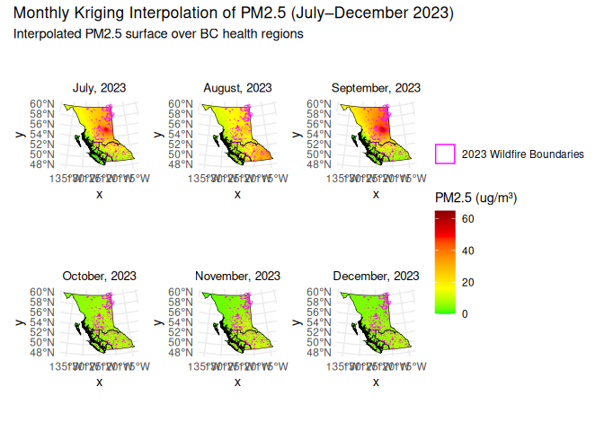
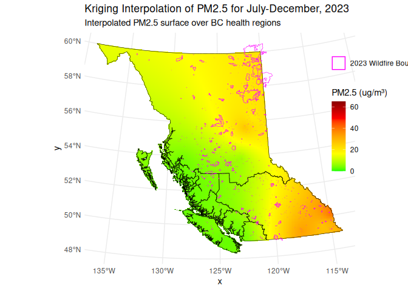
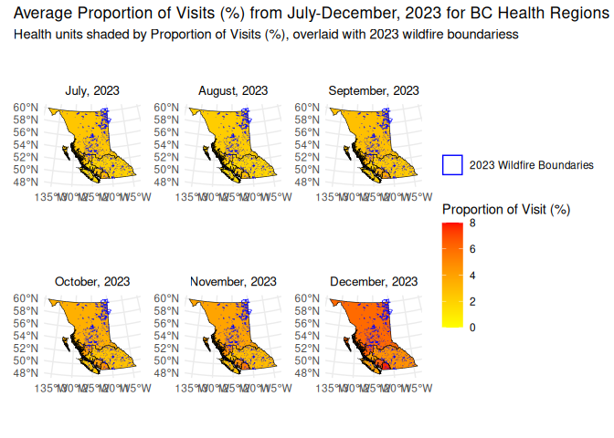
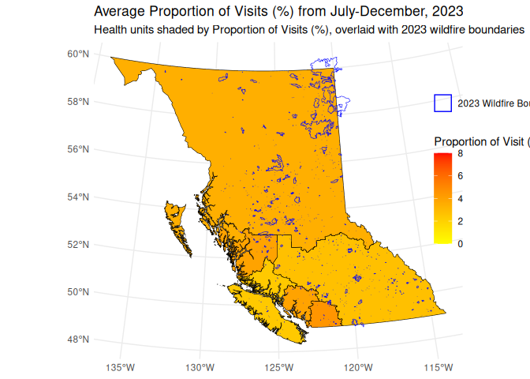
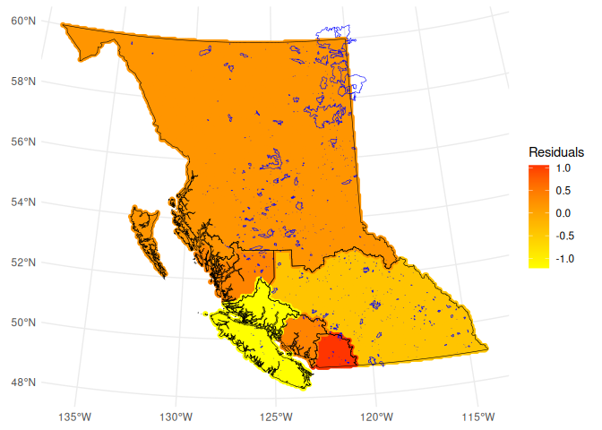

<!-- README.md is generated from README.Rmd. Please edit that file -->

# Analyzing the Effects of the 2023 Canadian Wildfires on Public Health in British Columbia

<!-- badges: start -->
<!-- badges: end -->

Hayden Ivie (400448224)  
Chloe Butler-Stubbs (400470143)  
Nikolas Aleksa (400498857)  
Michelle Cong-Bowers (400400803)  
Cyllanie Henry (400420513)  
Erin Naguit (400373494)  
Shifa Valyani (400391948)  
Yichen She (400228530)

Final project for [ENVSOCTY 4GA3 Applied Spatial
Statistics](https://academiccalendars.romcmaster.ca/preview_course_nopop.php?catoid=53&coid=267722)
(McMaster University)

## Abstract

This paper reports our analysis of cardiorespiratory related health
issues in British Columbia, and its relationship with spatial proximity
to wildfire locations in 2023-2024. Data were obtained from the Health
Canada Portal, Open Canada Portal, and the British Columbia Air Data
Archive and Healthideas Portal.

<!--This create a page break, i.e., starts a new page-->
<!--\newpage-->
<!--Use "#" for section headers-->

# Introduction

As the rate and intensity of wildfires is at an all-time high and only
expected to worsen due to the progression of climate change, there
becomes a growing necessity to protect the health of those who live in
areas especially prone to such disasters, like British Colombia. The ash
and debris released during wildfires is transported through the air and
inhaled by humans, including the most concerning PM2.5 particulate
matter which can lead to various respiratory ailments and even death
(Human health effects of wildfire smoke report summary, Health Canada,
2024). The province experienced their worst wildfire season yet in 2023
(Jain et al., 2024), which was chosen as the temporal scope of our
study. Knowing how, where, and when populations will be most impacted by
wildfire smoke could be extremely useful for hospitals and citizens to
prepare, and our study aims to contribute to this knowledge. This study
attempts to first visualize and interpolate the July-December 2023 data
PM2.5 air quality contamination and proportion of respiratory illness
related physician visits across British Colombia. The two parameters are
compared, and their correlation is examined to better understand the
magnitude and function of their spatial relationship.

# Background

Wildfires in Canada have had massive impacts on the mental and physical
wellbeing of those affected (Lowe & Garfin, 2023). These widespread
wildfires are a massive source of smoke leading to increased air
pollution and high concentrations of PM2.5 in the atmosphere. Studies
such as air quality modelling and in-situ measurements have been
conducted and have shown that the inhalation of PM2.5 particulates is
associated with increased premature mortality and various other
cardiorespiratory health problems (Matz et al., 2020). Additionally, the
wildfires have been very expensive, costing Canadians between “CAD 410
million to CAD 1.8 billion for short-term health effects and as much as
CAD 4.3 billion to CAD 19 billion for long-term health effects” (Human
health effects of wildfire smoke report summary, Health Canada, 2024).
According to Health Canada, there are up to 250 wildfire related deaths
due to short-term particulate exposure, and up to 2,500 deaths from long
term exposure (Human health effects of wildfire smoke report summary,
Health Canada, 2024).

The increasing frequency of wildfires in Canada is becoming extremely
worrying and is affecting the mental health of Canadians, largely
causing anxiety among the younger populations, while also affecting the
physical health of all who live in areas where smoke reaches (Eisenman &
Galway, 2022). This is becoming very problematic, as the intensity and
frequency of wildfires is not going to slow down (Wasserman & Mueller,
2023). Our research hopes to highlight the correlation between spatial
proximity/exposure to wildfires represented by areas of increased PM2.5
air quality contamination and the relative magnitude of health problems
faced, focused on cardiorespiratory-related health clinic visits
(Austin, 2023).

Current research has shown that there is a strong correlation between
proximity to wildfires and increased health and cardiovascular problems
(Douglas-Vail et al., 2023). These factors will be further analyzed with
a focus on the province of British Columbia to determine if this spatial
relationship can be statistically seen through linear regression
analysis of PM2.5 air quality concentration against health visit data.
This analysis is being done to see if there are ways in-directly measure
the effects (direct measurement would be health data against fire
location). This study will be very significant as the expected amounts
of large- and small-scale wildfires are expected to increase as the
effects of climate change are continuing to be more expressed (Grant &
Runkle, 2022). This research will allow physicians, climate scientists
and other researchers to work together to try to reduce the amounts of
wildfires, minimize the harmful health effects and make sure the spatial
relationship is more well understood for future preventative measures
(Grant & Runkle, 2022).

# Study area

This research focused on British Columbia (BC), Canada, a region with
long, hot, dry summer and large forest cover.

During the 2023 wildfire season, a total of 2245 wildfires occurred,
more than 2.84 million hectares of land were burned. 72% of the
wildfires in 2023 were due to natural causes, and around 25% were caused
by human activities. Wildfires concentrated in central and northwest BC,
but the impact of these wildfires spread to the entire province,
including urban areas such as Vancouver.

<!-- -->

Figure 1: Health Regions and Provincial outline of British Columbia,
Canada

# Data

# 1. Wildfire Data

Wildfire Data were acquired from Open Canada Portal, in the format of
.kmz file. It showed the boundaries of wildfires. By overlaying wildfire
boundaries to air pollution and health data maps, we can visually
examine possible relationships among wildfire, air quality and
healthcare utilization.

# 2. Air Quality Data

We used monthly measurements of air quality from The British Columbia
Air Data Archive. Our primary focus was on PM2.5(particulate matter with
diameter $\le$ 2.5um). These datasets contain PM2.5 values such as
average, corresponding date, time etc. for different air quality
monitoring stations. PM2.5 data were interpolated to create continuous
surface of air quality for each month from July to September 2023. This
approach produced predictions of PM2.5 levels in areas without air
quality monitoring stations.

# 3. Health Utilization Data

Health-related data were from Health Canada and Healthideas (Ministry of
Health). These datasets include age groups, number of cases related to
respiratory diseases, number of hospital visits, population etc.

# Methods

The methods used in this report involved retrieving PM2.5 air quality
data from the British Columbia Air Data Archive and compiling a CSV
containing Station Name, Longitude, Latitude, Month, and PM2.5
concentrations. Latitude and Longitude data had to be separately
georeferenced, using the British Columbia Air Data Archive location and
Google Earth to view coordinate values. Data was then imported into R
using the read.csv() function, and the header names were reformatted to
allow them to be easily used in further functions. The initial step was
to sort through the two datasets to find the highest and lowest
concentrations of PM2.5, that would be used for plotting. Using a pipe
operator, any non-values were filtered out, and the data from the same
data at every station was averaged. The outputs showed that PM2.5 peaked
in July-August 2023 and decreased towards the winter months. Based on
this info it was determined that the best 6-month period to plot was
from July to December of 2023.

To plot the air quality data as a raster surface over the entire
province of British Columbia, an interpolation using the Kriging method
was used as this method allows for the most accurate and least unbiased
interpolation. To perform this step, a long coding process involving the
creation of sf and sp features, verifying coordinate systems, creating
variograms and fitting them to the best models, creating a raster grid
over the provincial polygon, and performing the actual Kriging process
was done. This resulted in the creation of 6 separate interpolated maps
of BC for the months of interest. These 6 maps were then plotted
together to show the time series analysis of PM2.5 concentrations.
Another interpolation was also done using the air quality data from
every month, to create an average interpolation of the air quality in BC
for the 6-month study period. Geometries of the wildfire boundaries in
2023 were overlaid on every map.

For the health data analysis, 6 choropleth maps were created that
plotted the proportion of health clinic visits (%) for
cardiorespiratory-related reasons for the five provincial health regions
(Northern, Interior, Fraser, Vancouver Coastal, and Vancouver Island).
This was also performed in R by merging a CSV file containing the health
data with the data frame in R containing the polygon geometry features
corresponding to the health regions. Merging the two data sets by a
unique ID code allowed for the easy plotting of region-based health data
in defined zones in BC. Similarly to the Interpolated PM2.5 data, these
6 maps were then plotted together to show the time series analysis of
health visit proportions. As well as a choropleth map containing the
data for all 6 months to show the average health clinic visits (%) in BC
for the 6-month study period. Geometries of the wildfire boundaries in
2023 were overlaid on every map.

The last map was created using the residuals from the linear regression
in the previous plot. The interpolated map of the air quality data
(which used the Kriging Method) and the Health Data was the basis for
the data which the residuals were derived from. This data was overlaid
the wildfire boundary layer both as sf-objects. To get a clear
representation of where residuals were highest and lowest, a scale
colour gradient was added, where low residuals were yellow, mid-range
was classed as orange, and high residuals were red.

The last step statistical method that was performed was a linear
regression of the Health Data against the PM2.5 air quality data. This
was performed in R, by originally merging the 6-month krige
interpolation data with the mean health data from all 6 months. They
were merged by a unique ID corresponding to the health region zone. This
resulted in a datagram consisting of the meant 6-month interpolated
PM2.5 data for each zone, as well as the mean proportion of health
clinic visits for each zone. Thus, there were 5 data points for PM2.5
and 5 data points for the health data. The linear regression of the
Average Proportion of Health Clinic Visits against the Mean Interpolated
PM2.5 Air Quality Data was then performed.

# Results

<!-- -->

Figure 2: Average Monthly Kriging Interpolation of PM2.5 Air Quality
Concentrations over BC Health Regions showing a temporal progression
from July to December 2023.

<!-- -->

Figure 3: Kriging Interpolation of PM2.5 Air Quality Concentrations over
BC Health Regions showing average between July to December 2023.

<!-- -->

Figure 4: Average Monthly Proportion of Health Clinic Visits for BC
Health Regions showing a temporal progression from July to December
2023.

<!-- -->

Figure 5: Proportion of Health Clinic Visits for BC Health Regions
showing average between July to December 2023.

<!-- --> Figure 6:
Residuals of the Health Data against PM2.5

| Metric                  | Value            |
|-------------------------|------------------|
| Residual Std. Error     | 0.9887 (df = 3)  |
| Multiple R-squared      | 0.04691          |
| Adjusted R-squared      | -0.2708          |
| F-statistic             | 0.1476 (1, 3 df) |
| p-value (overall model) | 0.7264           |

Table 1: Output from Average Proportion of Health Clinic Visits against
Mean Interpolated PM2.5 Air Quality Data Linear Regression.

# Analysis

The percentage of respiratory-related clinic and ambulatory visits
throughout BC’s five health areas was compared with the interpolated
PM2.5 air quality data to examine the relationship between
wildfire-related air pollution and respiratory health issues. The
datasets were averaged over a six-month period to identify spatial and
temporal trends.

The Kriging-interpolated PM2.5 concentrations for every month from July
to December 2023 are presented in Figure 2. There is a distinct temporal
progression in these maps. PM2.5 levels are considerably higher in the
Interior and Northern health zones in July and August. This coincides
with when wildfire activity is at its highest. In the months leading up
to winter, concentration progressively decreases. Most of the province
has comparatively low PM2.5 levels by December. Given that areas like
Vancouver Island and Vancouver Coastal continuously displayed the lowest
amounts across the period, the spatial distribution indicates that inner
city regions were more impacted than coastal ones.

The Kriging-interpolated PM2.5 averaged over the period of July to
December 2023 are shown in Figure 3. The average concentration is higher
in the Southeastern and Northeastern regions, while Vancouver Island and
the coastal regions have lower averages. This is in alignment with the
monthly trends in Figure 2, suggesting that the interior regions of the
province experience worse air quality during the wildfire season.

Figure 4 displays the average proportion of visits in each region for
each month from July to December. This series of maps show the increase
in visits to healthcare clinics over time, peaking in December. This
peak is likely explained by the normal spike in viral illnesses caused
by flu season, however the variation between regions could be related to
the PM2.5 trends. As seen in the December map, the proportion of visits
is highest in the Northern, Fraser and Interior regions which are nearby
or west of the wildfire boundaries and PM2.5 as seen in figure 3.

In Figure 5, the average proportion of visits over the July to December
2023 period shows a greater average in the Fraser, Northern and
Vancouver Coastal regions, while Vancouver Island has the lowest. There
is not a significant spatial trend across this time period. The lack of
spatial trend from July to December could be attributed to the influence
of the high monthly proportion of visits found in December 2023 which
could have skewed the merged datasets.

A linear regression was performed to further examine whether the
observed patterns between air population and health visits were
statistically significant. With an R-squared value of 0.04691, PM2.5
levels only account for approximately 4.7% of the variation in health
clinic visits. The adjusted R-squared value was negative (-0.2708),
which accounts for the sample size (5 in this case). When the model’s
adjusted R-squared value is negative, it usually means that the model
performs worse than merely averaging the health data without taking
PM2.5 into account. The F-statistic is 0.1467 with a p-value of 0.7264.
The p-value in this regression indicates whether there is a
statistically significant relationship between the variables. With a
p-value this high (higher than the typical 0.05 cutoff), we cannot say
the relationship is significant.

The model only included five points in the sample size, one for each
health region, which is a major contributing factor to this result. The
model’s limited statistical power at this low observation count makes it
extremely challenging to identify any significant impacts. Standard
errors of the regression estimation increase, making the test less
sensitive and the model more susceptible to random variations. The model
would have more degrees of freedom and smaller confidence intervals if
the sample size were larger. This would increase the likelihood of
identifying a statistically significant relationship, assuming one
exists. Other factors, such as age, population density, or access to
care, could also be included in a bigger sample, which could further
help in accurately describing the variation in the health data.

Figure 6 displays a map with the distinctive health areas colored by the
range of residuals from 1 to -1. This map is supported by the linear
regression, which has already been identified as having potential issues
with its diminished statistical power due to its meager sample size. In
the Interior and Northern regions, the residuals value is closer to 0,
implying a closer fit to the model, whereas the Vancouver Island and
Fraser regions have the greatest variation from 0, suggesting and
over-prediction/under-prediction of the model for these regions
(respectively). It is possible that the residuals are nearer to 0 in the
Interior and Northern reasons because these regions were closest to the
wildfire boundaries and have the greatest PM2.5 levels (Figure 3), so
there is a stronger connection between PM2.5 and negative health
effects. The regional variability in the residuals could be a
explanatory factor to the low R-squared value for the linear regression
(see Table 1).

Our initial hypothesis is still supported by the spatial and temporal
trends, despite the regression’s inability to give a statistically
significant result. Higher rates of respiratory-related clinic visits
were also observed in the areas with higher PM2.5 concentrations,
especially during the summer months when wildfires were more common. The
PM2.5 and health maps’ strong visual alignment indicate a possible
relationship, but the small sample size prevented a statistically
significant conclusion.

# Conclusion

The goal of this study was to investigate the possible connection
between wildfire intensity, PM2.5 air concentrations, and respiratory
clinic visits in British Columbia during one of its worst wildfire
seasons in 2023 (Jain et al, 2024). Methods such as Kriging
Interpolation and Point Pattern Analysis were used to determine the
connection between PM 2.5 concentrations and wildfire boundaries. These
results were then compared with the average health clinic visits over
the course of the study period. Despite research efforts the final
analysis, which used linear regression, could not determine a
significant relationship between the variables. This was most likely
caused by the relatively small dataset that only included the five
health authorities of British Columbia. Even though there was a lack of
confirmation, spatial and temporal trends indicate that there may have
been a connection. Regions impacted by the full force of the wildfire
season displayed high concentrations of PM2.5 and more clinic visits. In
contrast, regions like Vancouver Island that experienced a much less
intense wildfire season displayed lower concentration levels of PM2.5
and fewer clinic visits over the studied period.

The patterns displayed by the spatial and temporal data suggest that
there is a potential connection, but a larger data set and additional
research is needed. Further research is encouraged to use highly
detailed data that covers smaller time intervals like weekly or daily
records. Also, the inclusion of additional data such as age, population
density, and access to care may strengthen this argument. Furthermore,
early contact with health authorities is needed for the use of more
specific health records that would allow future investigations to
accurately display the correct number of respiratory-related clinic
visits.

# References

Austin, S. (2023, July 27). Canada lacks data on wildfire smoke and
minority health. The Narwhal.
<https://thenarwhal.ca/wildfire-smoke-health-impact-minority-communities/>

BC Centre for Disease Control. (2025). Health Care Visits for
Respiratory Illness: Primary care visits for respiratory illness.
<https://bccdc.shinyapps.io/respiratory_syndromic/>

British Colombia Ministry of Environment. (2023). BC Air Data Archive
Website. <https://envistaweb.env.gov.bc.ca/>

Douglas-Vail, M., Jiang, A., Erdelyi, S., Brubacher, J. R., & Abu-Laban,
R. B. (2023). Association of air quality during forest fire season with
respiratory emergency department visits in Vancouver, British Columbia.
The Journal of Climate Change and Health, 13, 100255.
<https://doi.org/10.1016/j.joclim.2023.100255>

Eisenman, D. P., & Galway, L. P. (2022). The Mental Health and
well-being effects of wildfire smoke: A scoping review. BMC Public
Health, 22(1). <https://doi.org/10.1186/s12889-022-14662-z>

Grant, E., & Runkle, J. D. (2022). Long-term health effects of wildfire
exposure: A scoping review. The Journal of Climate Change and Health, 6,
100110. <https://doi.org/10.1016/j.joclim.2021.100110>

Government of Canada. (2025). BC Wildfire Fire Perimeters – Historical.
Canada.ca. Government of British Columbia; Government of British
Columbia; BC Wildfire Service.
<https://open.canada.ca/data/en/dataset/22c7cb44-1463-48f7-8e47-88857f207702>

Health Canada/Government of Canada. (2024a, June 6). Human health
effects of wildfire smoke report summary. Canada.ca.
<https://www.canada.ca/en/services/health/healthy-living/environment/air-quality/wildfire-smoke/human-health-effects-report-summary.html>

Jain, P., Barber, Q. E., Taylor, S. W., Whitman, E., Castellanos Acuna,
D., Boulanger, Y., Chavardès, R. D., Chen, J., Englefield, P.,
Flannigan, M., Girardin, M. P., Hanes, C. C., Little, J., Morrison, K.,
Skakun, R. S., Thompson, D. K., Wang, X., & Parisien, M.-A. (2024).
Drivers and Impacts of the Record-Breaking 2023 Wildfire Season in
Canada. Nature Communications, 15(1), 6764–14.
<https://doi.org/10.1038/s41467-024-51154-7>

Lowe, S. R., & Garfin, D. R. (2023). Crisis in the air: The mental
health implications of the 2023 Canadian wildfires. The Lancet Planetary
Health, 7(9). <https://doi.org/10.1016/s2542-5196(23)00188-2>

Matz, C. J., Egyed, M., Xi, G., Racine, J., Pavlovic, R., Rittmaster,
R., Henderson, S. B., Stieb, D. M. (2020). Health impact analysis of
PM2.5 from wildfire smoke in Canada (2013–2015, 2017–2018). Science of
The Total Environment, 725, 138506.
<https://doi.org/10.1016/j.scitotenv.2020.138506>

Teucher A., Albers, S., Hazlitt, S., Province of British Colombia.
bcmaps: Map Layers and Spatial Utilities for British Columbia, The
Comprehensive R Archive Network.
<https://cran.r-project.org/web/packages/bcmaps/>

Wasserman, T. N., & Mueller, S. E. (2023). Climate influences on future
fire severity: A synthesis of climate-fire interactions and impacts on
fire regimes, high-severity fire, and forests in the Western United
States. Fire Ecology, 19(1).
<https://doi.org/10.1186/s42408-023-00200-8>
